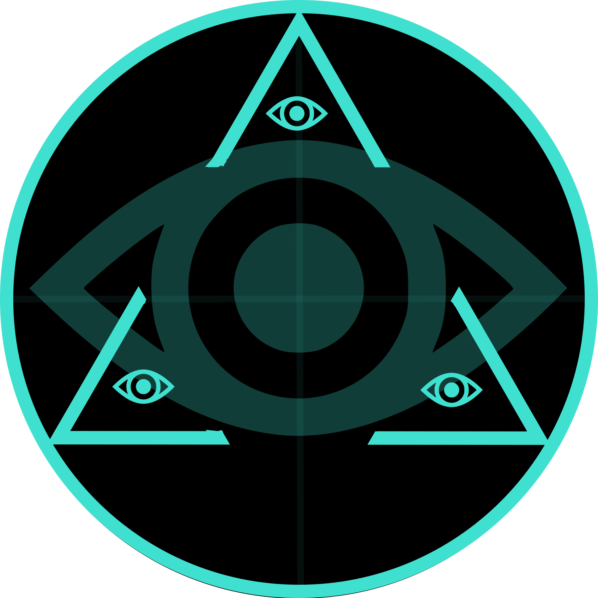

<h1 align="center">Ketameri</h1>

<p align="center">
  <a href="./LICENSE"></a>
  <a href="https://dotnet.microsoft.com/maui"></a>
  <a href="#"></a>
  <a href="#"></a>
</p>

<h3 align="center">
  Turn plain English into an ancient, alien-looking script — and read it straight back.
</h3>

<p align="center">
  
</p>

<p align="center">
  <strong>Ketameri</strong> is a cross-platform <a href="https://dotnet.microsoft.com/maui">.NET MAUI</a> app that
  translates ordinary text into a stylized glyph alphabet — then decodes Ketameri images back into plain text.
  The script reads <strong>right-to-left</strong>, the way you would read Hebrew.
</p>

<p align="center">
  <em>“Go forth and send ancient, alien-looking messages among your friends. Have fun. Cause mischief.
  Confuse your friends. Entertain yourself and others.”</em>
</p>

---

## ✨ Features

- **Text → Ketameri** — type or paste text and watch a live, image-based rendering of the glyph script appear.
- **Ketameri → Text** — load a `.png` of Ketameri text and reverse-translate it back into readable English.
- **Full alphabet** — browse the entire glyph set and export it as a single image.
- **Save & load** — persist your source text (`.txt`) and your rendered images (`.png`) directly from the app.
- **Live preview** — the glyph preview re-renders as you type.
- **One codebase, many platforms** — the same app runs on **iOS, Android, macOS, and Windows**.

## 🧠 How it works

A small, layered pipeline turns text into pixels and back. Every glyph is a tiny **9×9 bitmap**, so an image is a
fully self-contained, pixel-perfect encoding of the text:

1. **Phonetics** — maps each English character into the Ketameri (*Protodimic*) alphabet.
2. **Tokenizer** — groups characters into glyph *tokens* (letters, vowel/consonant digraphs, base-14 numbers, and special characters).
3. **LineJoinerSplitter** — lays glyphs out into a line (right-to-left), or splits a line of an image back into glyphs.
4. **PageJoinerSpliter** — stacks lines into a full page image, or detects and extracts lines from an image.
5. **Recognizer** — reads individual glyph bitmaps back into characters.

The high-level entry points are `SymbConvert.Translate(text)` (text → image) and
`SymbConvert.ReverseTranslate(image)` (image → text).

## 🧩 Project structure

This is a C# solution split into small, single-responsibility libraries. Only **`Symbs`** is the user-facing app;
the rest are portable, testable building blocks.

| Project | Purpose |
| --- | --- |
| **`Symbs`** | The .NET MAUI app: UI, navigation, image rendering, and save/load. |
| **`Symbol`** | Base glyph model: `LetterSymbol` (12-bit 9×9 glyphs) and `NumberSymbol` (base-14 digits). |
| **`Glyph`** | Maps characters (vowels, consonants, digraphs, numbers, punctuation, space) to symbols. |
| **`Graphic`** | Renders glyphs to bitmaps (small 9×9 / large 54×54) and colorizes them; `CachedGraphic` loads from an embedded cache. |
| **`Tokenizer`** | Forward (text → glyphs) and reverse (glyphs → text) tokenization. |
| **`Recognizer`** | Recognizes a single glyph image back into a glyph. |
| **`LineJoinerSplitter`** | Joins a glyph array into a line and splits a line image into glyphs. |
| **`PageJoinerSpliter`** | Joins lines into a page image and splits a page into lines. |
| **`Phonetics`** | English ↔ Ketameri character mapping. |
| **`SymbConvert`** | High-level `Translate` / `ReverseTranslate` orchestration. |
| **`SymbProcess`** | Async wrapper over `SymbConvert` for the app. |
| **`Resources`** | Embedded resources: the glyph cache (`Glyphs.json.gz`), sample texts, border art, and the About text. |
| **`SymbolTest`** | A console app that exercises the full encode/decode pipeline and writes a visual compendium. |

## 🚀 Getting started

**Prerequisites**

- [.NET 10 SDK](https://dotnet.microsoft.com/download/dotnet/10.0)
- The **MAUI** workload: `dotnet workload install maui`
- The platform toolchain for the target you're running on (e.g. Xcode for iOS/macOS, Android SDK for Android, Windows build tools for Windows)

**Clone and build**

```bash
git clone https://github.com/chazzofalf/ketameri.git
cd ketameri
dotnet workload install maui   # if not already installed
dotnet build Symbs.sln
```

**Run**

Open `Symbs.sln` in Visual Studio (or Rider), pick a target device/emulator, and run the **`Symbs`** project.

## 🧪 Testing & the compendium

`SymbolTest` is a standalone console project that drives the entire pipeline (symbols → graphics → tokenization →
recognition → line/page join/split → full translate/reverse-translate) and emits a visual *compendium* of sample
translations (text in, image out, text back out) so you can eyeball the round-trip fidelity.

```bash
dotnet run --project SymbolTest
```

## 📜 License

Released under the **MIT License** — see [LICENSE](./LICENSE) for the full text.

## 💬 Author

Built by **Charles Timothy Montgomery** ([@chazz_the_intrepid](https://github.com/chazzofalf)).
This project is a bit of playful worldbuilding: a little constructed script for sending mysterious,
cryptic-looking messages to friends. Use it wisely — exercise some common sense in your antics. :D
